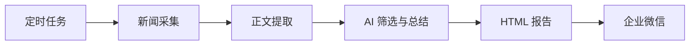

# 新闻监控、内容总结与自动推送技术实现

## 推送流程

系统由定时任务触发，依次抓取 RSS 或网站新闻列表、补充文章正文，并把筛选后的结果生成 HTML 报告和企业微信消息。



- 新闻列表支持标准 RSS；没有 RSS 的站点可按网页新闻源抓取。
- 正文提取与列表抓取分离：列表用于发现新闻，文章页用于补充可用于总结的证据。
- 统一的运行入口完成采集、分析、报告生成和通知发送，定时频率由部署配置决定。

## 内容总结

每条新闻按可取得的证据从高到低处理：优先使用文章正文；正文不可用时使用 RSS 或页面摘要；仍不可用时仅依据标题。后两种情况会保留证据不足提示，避免把未知信息写成事实。

AI 按主题相关度筛选候选新闻，并按育种价值排序；每条入选新闻生成中文摘要。排名前 5 条作为重点新闻。开启二次证据校审后，系统会再次检查摘要是否被已有证据支持。

正文提取只读取可访问的公开页面；遇到登录、付费墙、访问限制或正文不足时，自动降级为摘要或标题，不尝试绕过限制。

## 推送内容

企业微信消息包含：

- 一段简短汇总；
- 前 5 条重点新闻及其逐条摘要；
- 每条新闻的原文链接。

同一批结果还会生成 HTML 报告留档，便于在浏览器中回看完整的筛选结果和链接。

## 增加监控网站

优先使用网站公开的 RSS 地址，在 `config/config.yaml` 的 `rss.feeds` 下增加一项：

```yaml
rss:
  feeds:
    - id: "example-rss"
      name: "示例 RSS 新闻源"
      url: "https://example.org/news/feed.xml"
      max_items: 30
      max_age_days: 1
```

没有 RSS 但新闻列表为普通网页时，使用 `web_news`：

```yaml
rss:
  feeds:
    - id: "example-web-news"
      name: "示例网站新闻"
      url: "https://example.org/news/"
      source_type: "web_news"
      max_items: 30
      max_age_days: 1
```

随后用实际页面验证标题、日期和原文链接能否正确提取。对页面结构特殊的网站，可在 `trendradar/crawler/rss/web_news.py` 增加该站点的匹配规则或专用解析逻辑；若来源为特殊 JSON 接口，则同时在该文件增加 JSON 解析函数，并在 `trendradar/crawler/rss/fetcher.py` 增加对应的 `source_type` 分发分支。
