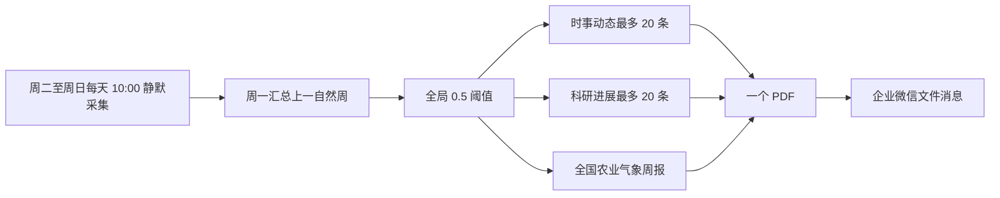

# 农业育种周报推送技术说明

## 周报流程

系统在周二至周日每天北京时间 10:00 静默采集数据。每周一以 `published_at` 严格筛选上一自然周的内容，并应用全局 `0.5` 分数阈值。周报固定为三个模块：时事动态最多 20 条、科研进展最多 20 条，以及不占新闻名额的全国农业气象周报。学术来源及正文明确给出期刊名或完整论文题名的内容归入科研进展；其余水稻相关内容归入时事动态。最后通过企业微信 `upload_media` 上传并仅发送一个 PDF 文件。



## 时间范围与失败重试

内容范围只按独立自然周计算：周一生成上一自然周周报，不使用滚动时间窗口或首次采集时间作为资格依据。

固定来源优先复用现有网页列表解析器；AMIS、MAFF 等文档型来源共用一个官方文档解析器。部分日期缺库或部分来源失败时继续生成，并在 PDF 的“来源采集状态”中说明；仅当窗口内没有任何可用来源证据时中止。

周一 12:10 首次运行周报任务；若当期任务尚未成功，则在 12:30、13:00、13:30 自动重试。周成功检查点确认 PDF 已生成并作为文件消息送达企业微信；一旦成功，后续触发会在采集、分析和外部推送前短路，不会重复运行周报主线。

## 交付格式

周报固定交付为一个专用 A4 PDF，企业微信只接收这一个文件消息。

## 非 Docker 的 PDF 工具

非 Docker 部署需安装 Poppler。运行时会调用 `pdfinfo` 和 `pdftotext` 验证 PDF；若二者不在 `PATH` 中，可用 `PDFINFO_BIN` 和 `PDFTOTEXT_BIN` 指向绝对路径。Windows PowerShell 示例：

```powershell
$env:PDFINFO_BIN = 'C:\poppler\Library\bin\pdfinfo.exe'
$env:PDFTOTEXT_BIN = 'C:\poppler\Library\bin\pdftotext.exe'
```

Docker 镜像已包含 Poppler，无需额外配置。
