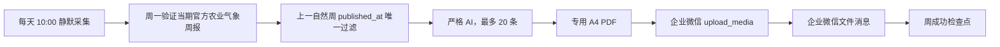

# 农业气象周报推送技术说明

## 周报流程

系统每天北京时间 10:00 静默采集数据。每周一先验证当期官方全国农业气象周报，再以 `published_at` 严格筛选上一自然周的内容；AI 严格筛选最多 20 条，生成专用 A4 PDF。最后通过企业微信 `upload_media` 上传 PDF，并仅发送企业微信文件消息。

## 时间范围与失败重试

内容范围只按独立自然周计算：周一生成上一自然周周报，不使用滚动时间窗口或首次采集时间作为资格依据。

周一 10:30—12:00 用于重试尚未取得的当期官方农业气象周报。周成功检查点确认 PDF 已生成并作为文件消息送达企业微信；未通过时继续按该重试窗口处理。

## 交付格式

周报固定交付为专用 A4 PDF。企业微信只接收一个文件消息，不发送摘要、网页预览或其他文本消息。
