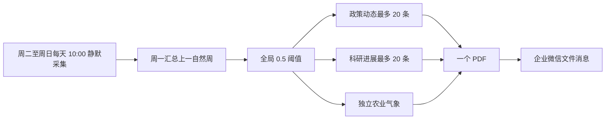

# 农业育种周报推送技术说明

## 周报流程

系统在周二至周日每天北京时间 10:00 静默采集数据。每周一以 `published_at` 严格筛选上一自然周的内容，并应用全局 `0.5` 分数阈值。周报由三个独立模块组成：政策动态最多 20 条、科研进展最多 20 条，以及不占新闻名额的农业气象模块。周一验证当期官方全国农业气象周报后，将其纳入独立气象模块。最后通过企业微信 `upload_media` 上传并仅发送一个 PDF 文件。



## 时间范围与失败重试

内容范围只按独立自然周计算：周一生成上一自然周周报，不使用滚动时间窗口或首次采集时间作为资格依据。

周一 10:30—12:00 用于重试尚未取得的当期官方农业气象周报。周成功检查点确认 PDF 已生成并作为文件消息送达企业微信；未通过时继续按该重试窗口处理。

## 交付格式

周报固定交付为一个专用 A4 PDF，企业微信只接收这一个文件消息。

## 非 Docker 的 PDF 工具

非 Docker 部署需安装 Poppler。运行时会调用 `pdfinfo` 和 `pdftotext` 验证 PDF；若二者不在 `PATH` 中，可用 `PDFINFO_BIN` 和 `PDFTOTEXT_BIN` 指向绝对路径。Windows PowerShell 示例：

```powershell
$env:PDFINFO_BIN = 'C:\poppler\Library\bin\pdfinfo.exe'
$env:PDFTOTEXT_BIN = 'C:\poppler\Library\bin\pdftotext.exe'
```

Docker 镜像已包含 Poppler，无需额外配置。
